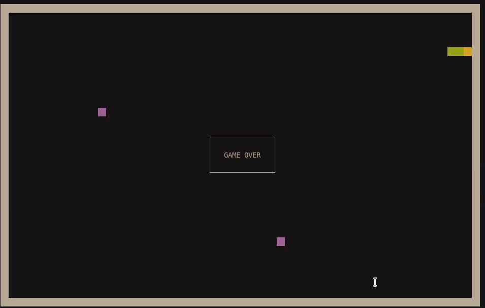

# ncsnake - a simple ncurses snake game

This repository holds the source code for my first ncurses program - a small snake game.
This is by no means a serious project, just some practice to learn the ropes of the library.

## Game Rules

The game plays very much like the standard snake. You can use either WASD, arrow or Vim keys
to change directions. Eat as much food as you can, the speed of the snake increases slightly
every 5 pieces eaten. Running into a wall or yourself results in a game over.

You can pause and unpause the game by pressing p. Pressing q quits the game instantly (your score
will still be printed).

The size of the arena is determined by the size of the terminal at the moment of launching
the program. Resizing the window may result in undefined behavior and is not advised.

## Installation

Make sure you have ncurses installed and run the following command (if necessary, as root):

    make install

After that you can launch the game with `ncsnake`.
